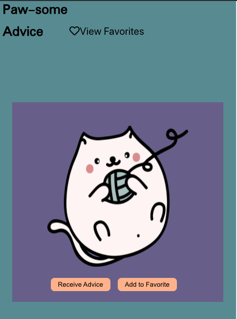
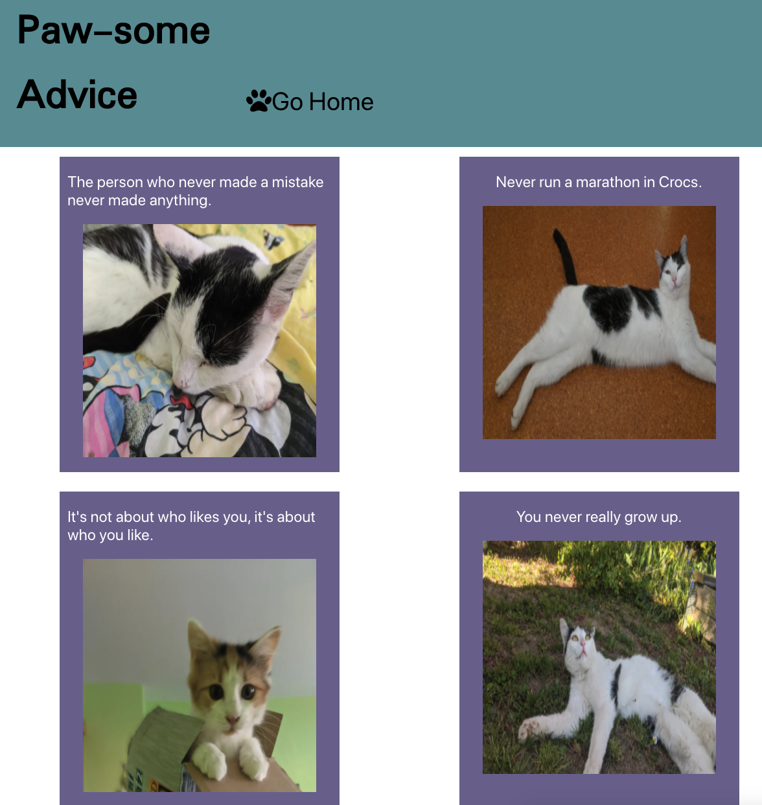

# Paw-some Advice
For cat folks transitioning back into society during a pandemic 

## Description
- Receive advice paired with adorable cats
- Save your favorites and view them for later

## Setup
- Fork this project to your own Github account
- Clone the repository to your local machine
- `cd` into the project
- `open index.html` to open GitHub pages
## Accessibility
The application's design is responsive with several breakpoints to accommodate various screen sizes 
## Next Steps
- Add the ability to play a game of match with favorited advice
## Goals
- Sharpen React skills like Router and testing with Cypress.
- Continue to work with parsing new APIs 
## Authors
Melanie Daoheuang [@daomeow](https://github.com/daomeow)